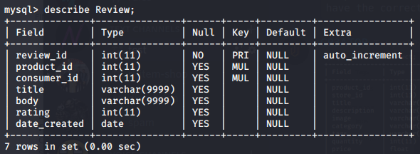

# Database-Population-Scripts
Populate a MySQL database with a JSON dataset using python script automation.
Reviews.json contain a sample of 100 reviews in JSON format and
meta_Appliances.json a sample of 100 products in JSON format

# Setup
- Host can be changed to an IP if populating remotely
- Password should contain the password to the database
- Database should contain the database's name

### Populate tags field in Product table with parseTags.py

### Populate Product table with parseJSON.py

### Populate Review table with parseReviews.py

### Generate passwords for Vendor table with parseVendor.py

